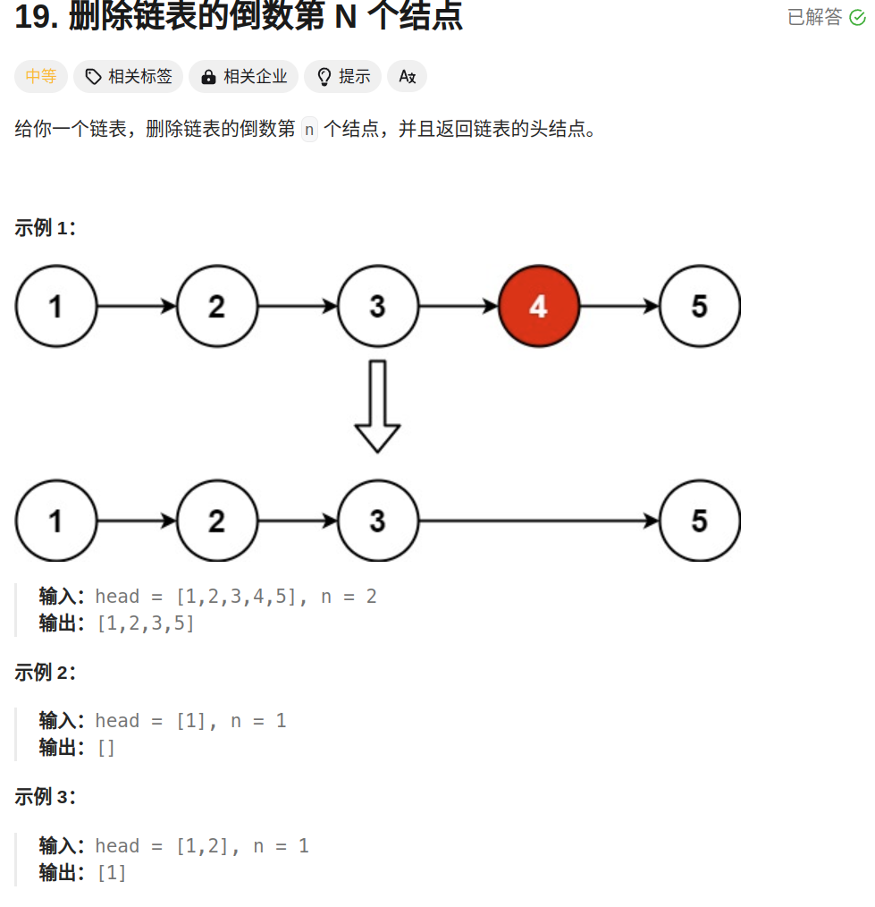

# Leetcode

## 子串

### 和为k的子数组


**思路：前缀和+哈希表**

前缀和： 用pre[i]表示nums中0到i的值，和为k的子数组就是pre[i] - pre[j-1]（j到i的数组）

哈希表：存放前缀和和出现的次数（nums中包含负数）

循环一次即可解决

**易错**：用哈希表应初始化一个（0，1）的键值对

### [滑动窗口最大值](https://leetcode.cn/problems/sliding-window-maximum/)


**思路**：滑动窗口内构造一个单调递减的双端队列（deque）；


**易错:**在循环中形成滑动窗口后应将第一次的最大值放进结果中；


## 二分查找

**二分查找示意图：**


****

***tips：在一个单调或者局部单调有序数组中查找一个符合某些条件的值，时间复杂度为O(logN)***


### 35 [搜索插入位置](https://leetcode.cn/problems/search-insert-position/)


题目让找到**第一个大于等于target值的**下标，如果所有树都小于target，返回数组长度。

**可以采用闭区间做法（左右两个边界可以取到）**，循环过程中左右两个边界值都要在中间位置再多移动一次

```c++
    int searchInsert(vector<int>& nums, int target) {
        int left = 0, right = nums.size() - 1;
        //所有数都大于target，right会收缩到left = 0
        //所有数都小于target，只会移动left，最后会加到right+1，即数组长度
        while (left <= right) {
            //闭区间做法，可以取到左右两个位置
            //取等号时移动右边让其收缩到左边的位置
            if (target > nums[left + (right - left) / 2]) {
                left = left + (right - left) / 2 + 1;
            } else {
                right = left + (right - left) / 2 - 1;
            }
        }
        return left;
    }

```

### 74 搜索二维矩阵


两种思路：一种先在第一列使用二分法找到target可能在哪一列，再在对应列用二分法找到是否存在

另一种将矩阵各行拼接起来，使用二分法找到是否存在矩阵中。

### 33 搜索旋转排序矩阵


思路：两次二分，

第一次二分查找旋转点（通过和末尾数比较判断旋转点位置，大于末尾数表示当前在旋转点前面，小于末尾数表示在旋转点后面）

**易错：** 旋转点有可能在0，所以判断旋转点时left从-1遍历（更新后会让left一定增加）

第二次二分来找是否有对应的整数（通过和最末尾的数比较判断是在哪一段）

第一次二分查找旋转点代码如下:

```cpp
 int search(vector<int>& nums, int target) {
     //l从-1开始
        int l = -1, r = nums.size() - 1;
        //旋转点为l，l可能为0
        while(l < r - 1) {
            int mid = l + (r - l) / 2;
            if(nums[mid] > nums.back()) {
                l = mid;
            } else {
                r = mid;
            }
        }
```

最后输出的l变量为旋转后第一段的末尾，r变量为旋转后第二段的开始（旋转下标k=0时相当于没有旋转，也就没有第一段，此时l = -1保持初始值不变）


## 链表

链表由若干个节点组成，每个节点包含数据和指向下一个元素的指针，常见定义：

```c++
#include <bits/stdc++.h>

using namespace std;

//定义一个结点模板
template<typename T>
struct Node {
	T data;
	Node *next;
	Node() : next(nullptr) {}
	Node(const T &d) : data(d), next(nullptr) {}
};
```

### 常见问题总结

链表通常无法高效获取长度、无法根据偏移快速访问元素是两大劣势。

常见问题如获取**倒数第K个元素、获取中间位置的元素、判断链表是否存在环、判断环的长度**等和**长度与位置**有关的问题，都可以通过使用双指针来解决。

判断是否存在环：

```c++
/**
 * Definition for singly-linked list.
 * struct ListNode {
 *     int val;
 *     ListNode *next;
 *     ListNode(int x) : val(x), next(NULL) {}
 * };
 */
class Solution {
public:
    bool hasCycle(ListNode *head) {
        //使用快慢指针，有环快指针一定会再次和慢指针相遇
        ListNode* fast = head, *low = head;
        while(fast && fast->next) {
            //对节点指针调用next方法时要确保不为空指针
            fast = fast -> next;
            fast = fast -> next;
            low = low -> next;
            if(low == fast) {
                return true;
            }
        }
        return false;
    }
};
```

**双指针确定倒数第n个节点**



这题本质上想考察的是，在不知道链表长度的前提下，设计一个算法，在「到达链表末尾的瞬间」就能知道倒数第 *n* 个节点。

**注意：头部额外引入一个节点，同时节点移动到目标节点前一个，方便将目标节点删掉**

```c++
class Solution {
public:
    //核心在如何找到倒数的第n个节点
    ListNode* removeNthFromEnd(ListNode* head, int n) {
        //构造两个指针，一个先走n步，然后再两个一起走，
        //先走n步的指针到末尾时，另一个指针就到了倒数第n个节点的位置
        ListNode* res = new ListNode(0);
        res -> next = head;
        //左右节点的下一个节点是head
        ListNode* left = res, *right = res;
        //右节点首先移动n次,从head节点往后移动n-1次
        while(n--) {
            right = right -> next;
        }

        //左右节点一起移动，结束条件为右节点下一个节点为空（左节点停在倒数第n个节点前一个）
        while(right -> next) {
            left = left -> next;
            right = right -> next;
        }
        left -> next = left -> next -> next;
        return res -> next;
    }
```

