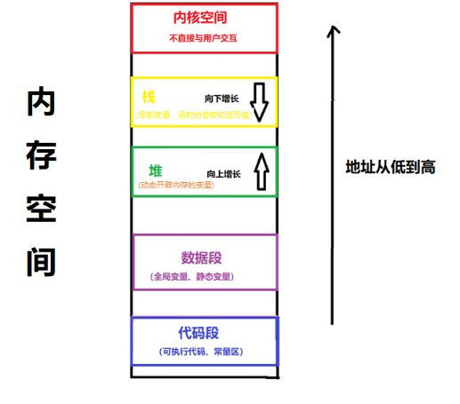

# 内存
## 1 内存分配方式
c++中，程序运行时，内存主要分为四部分：堆、栈、数据段和代码段


栈：存储局部变量、函数参数和返回值。  
堆：存储动态开辟内存的变量。  
数据段：存储全局变量和静态变量。  
代码段：存储可执行程序的代码和常量（例如字符常量），此存储区不可修改。 

__栈和堆的主要区别：__  
__管理方式不同：__ 栈系统自动分配，出作用域自动释放；堆需手动释放（使用new和delete管理）  
__空间大小不同：__ 栈空间较小，一般只有8m；堆内存较大，受限于物理内存空间。  

## 2 空指针、野指针
在C和C++中，用0或NULL都可以表示空指针。c++11中引入nullptr表示空指针。  
声明指针后，在赋值之前，让它指向空，表示没有指向任何地址。  
___空指针解引用程序会崩溃___  ,常见解决方法是在需要解引用的时候添加一个判断函数。  
```cpp
void func(int* no, string* str)    
{
	if ((no == 0) || (str == 0)) return;  

	cout << "亲爱的" << *no << "号：" << *str << endl;
}
```  

### 野指针：
指针指向不是有效的地址。  
出现情况主要有三种：（有时候程序不崩溃，指向地址为空闲的就不崩溃）  
1) 指针定义时未初始化
2) 指针指向动态分配的内存，内存释放后，指针指向的地址失效
3) 指针指向变量超越变量的作用域。一般是指向了函数的局部变量，或把函数局部变量的地址返回给了指针。

规避方法：  
1) 指针定义时，初始化为nullptr
2) 动态分配内存释放后，赋值为nullptr
3) 不要返回局部变量的地址
4) 智能指针